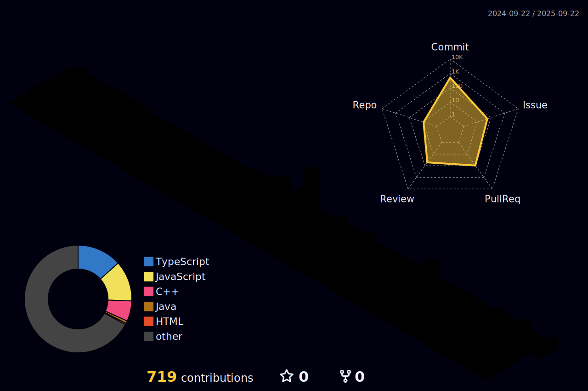

    <h2 style="border-bottom: 1px solid #d8dee4; color: #282d33;"> 🛠️ Tech Stacks </h2>   
    
 
         
         
         
        
        
          

    

     

 

<h2>🏅 Project</h2>

<table  width="100%">
  <thead>
    <tr>
      <th width="20%">PERIOD</th>
      <th width="30%">TITLE</th>
      <th width="50%">SUBJECT</th>
    </tr>
  </thead>
  <tbody>
    <tr>
      <td>2024.05&nbsp;-&nbsp;2024.11</td>
      <td>🥇 교내 경진대회 (최우수상)</td>
      <td>여행 코스 추천 웹 사이트</td>
    </tr>
    <tr>
      <td>2025.03&nbsp;-&nbsp;2025.03</td>
      <td>🥇 단국대학교 해커톤 (대상)</td>
      <td>스크린샷 정리 자동화 OpenAI를 활용 요약 + 카테고리 분류 + 폴더 저장 서비스</td>
    </tr>
  </tbody>
</table>

  

